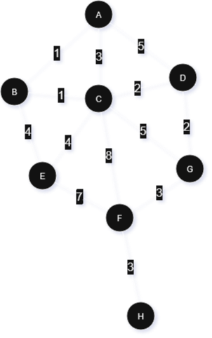

## UCS - Uniform Cost Search

UCS è un algoritmo che lavora su grafi non orientati pesati, quindi ogni collegamento tra due nodi ha un costo o peso. <br>
L'obiettivo di questo algoritmo è di trovare il cammino di costo minimo da un nodo a un altro. <br>
un **cammino di costo minimo** è un cammini, quindi una serie di archi consecutivi che portano da un nodo A ad un nodo B passando per nodi via via adiacenti. "Di costo minimo" significa che ha la somma dei costi per i signoli archi è la più bassa che possiamo avere se vogliamo andare dal nodo A al nodo B.

L'idea è quella di andare a visitare prima i nodi che ci costa meno raggiungere, a differenza di quanto facciamo con BFS dove esploriamo prima i nodi meno distanti dal centro. Dove per distanza intendiamo il numero di nodi che compongono il cammino.

### Implementazione

Come abbiamo detto, UCS è molto simile a BFS, solo che ragiona per nodi meno costosi da raggiungere. Per fare ciò la cosa più facile da fare è estendere BFS utilizzando una priorityQueue al posto della Queue. <br>
La priorityQueue è una struttura dati che ci permette di accedere sempre all'elemento con priorità più alta. In questo caso la priorità che diamo ai nodi è il costo per raggiungere i vari nodi. In questa maniera avremo sempre a disposizione il nodo con costo minore da raggiungere.

Per tenere traccia di quali nodi sono già stati visitati, utilizziamo una lista. Potremmo anche usare un attributo dell'oggetto nodo, ma richiederebbe di andare a modificare la classe dell'oggetto che non sempre è possibile.

```
per ogni nodo adiacente al nodo considerato:
    aggiungo alla queue costo = costo(nodo considerato)+ costo(arco)
    segno il nodo come visitato
```

# Dijkstra

**premessa:** in seguito verrà detto visitato un nodo sul quale si sono svolte delle operazioni fra le quali vedere quali siano i suoi nodi adiacenti.
Nodo visto, sarà invece un nodo che è stato visualizzato soltanto come adiacente a un nodo visitato.
Come se stessimo andando in giro per dei paesini con un cannocchiale in mano. Una volta che entriamo in un paesino allora lo stiamo visitando, ma dalla torre del campanile con il nostro cannocchiale possiamo guardarci in torno e notare altri paesini. Questi, se non già visitati, allora sono soltanti visti.

---

Il principio di questo algoritmo è di migliorare UCS trovando il cammino di costo minimo per arrivare a un certo nodo. Per fare ciò, invece di fissare un costo a ogni nodo, appena questo nodo viene visto, ci lasciamo aperta la possibilità di modificare successivamente la sua distanza, fino a che non andiamo a visitarlo.

Se pensiamo di partire dal nodo radice, va da se che il cammino di costo minimo per arrivare al suo adiacente con costo minore, è necessariamente l'arco che collega la radice con questo arco. 



imposto tutti i nodi a stanza +inf
imposto la distanza del nodo iniziale a 0
carico tutti i nodi all'interno della priority queue
```
fintanto che al coda non è piena:
    prendere il primo nodo dalla queue
    imposto il nodo a visitato
    per ogni vicino:
        se il vicino non è visito:
            tmp = distanza(nodo considerato) + il peso dell'arco
            if tmp \< distanza(vicino):
                distanza(vicino) = tmp
                precedente[vicino] = nodo
```


## 🔍 Obiettivo dell’algoritmo di Dijkstra

L'**algoritmo di Dijkstra** serve a **trovare il percorso di costo minimo** (o cammino minimo) da un **nodo sorgente** a **tutti gli altri nodi** in un **grafo pesato** **senza pesi negativi**.

---

## 🧠 Idee chiave dietro l’algoritmo

1. Si parte dal nodo sorgente, assegnandogli distanza 0 e agli altri ∞.
2. Si cerca, tra i nodi non ancora visitati, quello con distanza minima.
3. Si aggiorna il costo per raggiungere i suoi vicini (relaxation).
4. Il nodo viene marcato come "visitato" (definitivo).
5. Si ripete finché non si sono visitati tutti i nodi o finché le distanze minime sono state trovate.

---

## 📘 Requisiti

* Il grafo deve essere **orientato o non orientato**, ma con **pesi non negativi**.
* Può essere rappresentato come:

  * Matrice di adiacenza
  * Lista di adiacenza (preferita per grafi sparsi)

---

## 🔧 Strutture dati usate

* **Coda di priorità (heap)** per scegliere il nodo con distanza minima.
* **Array (o dizionario)** per memorizzare:

  * Distanze minime
  * Nodo predecessore per ricostruire il cammino

---

## 📝 Pseudocodice di Dijkstra

```plaintext
Dijkstra(G, sorgente):
    per ogni nodo v in G:
        distanza[v] = ∞
        predecessore[v] = null
    distanza[sorgente] = 0
    coda = insieme di tutti i nodi in G

    mentre coda non è vuota:
        u = nodo in coda con distanza[u] minima
        rimuovi u da coda

        per ogni vicino v di u:
            se v è in coda:
                alt = distanza[u] + peso(u, v)
                se alt < distanza[v]:
                    distanza[v] = alt
                    predecessore[v] = u
```

---

## 📈 Esempio passo-passo

Supponiamo il seguente grafo:

```
       (A)
      /   \
    1/     \4
    /       \
  (B)-------(C)
     \2
      \
      (D)
```

* Nodo iniziale: A
* Archi con pesi: A-B(1), A-C(4), B-C(2), B-D(2)

### Passi dell’algoritmo:

1. **Inizializzazione**:

   * `distanza = {A: 0, B: ∞, C: ∞, D: ∞}`
2. Visitiamo A:

   * B: `0 + 1 = 1` → aggiorno `distanza[B] = 1`
   * C: `0 + 4 = 4` → aggiorno `distanza[C] = 4`
3. Nodo con distanza minore: **B**

   * C: `1 + 2 = 3` → aggiorno `distanza[C] = 3`
   * D: `1 + 2 = 3` → aggiorno `distanza[D] = 3`
4. Nodo con distanza minore: **C o D** (pari)

   * Supponiamo visitiamo C, nessun miglioramento
5. Visitiamo D, nessun vicino nuovo
6. Fine

Risultato:

* Distanze minime: `A: 0, B: 1, C: 3, D: 3`
* Cammini minimi:

  * A → B
  * A → B → C
  * A → B → D

---

## ⏱️ Complessità computazionale

* Usando **min-heap + lista di adiacenza**:
  **O((V + E) log V)**
  (con `V` nodi, `E` archi)

* Usando **matrice di adiacenza**:
  **O(V²)** (meno efficiente per grafi grandi e sparsi)

---

## ⚠️ Limiti

* ❌ Non funziona correttamente se ci sono **pesi negativi** (per questi si usa **Bellman-Ford**).
* ❌ Calcola i percorsi minimi **da una sorgente sola**.

---

## ✅ Applicazioni

* Navigazione GPS e mappe
* Routing in reti di computer
* Pianificazione logistica
* Intelligenza artificiale nei videogiochi

---

Se vuoi, posso anche fornirti un'**implementazione in Python** o **visualizzazioni** del funzionamento passo-passo. Fammi sapere!
